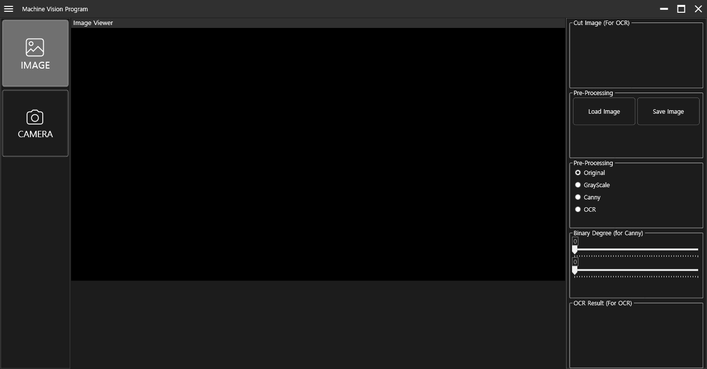

## MachineVision-WPF-Project

This project created a machine vision application using WPF in C# in a Windows environment for study purposes.
It is based on the nuget packages of Prism and Commnunity.Toolkit.Mvvm and OpenCVSharp4.

This is a program that allows you to apply Gray Image, Canny, or OCR functions to selected images or real-time camera screens.
The UI used DarkStyle using CustomControl.

</a>
